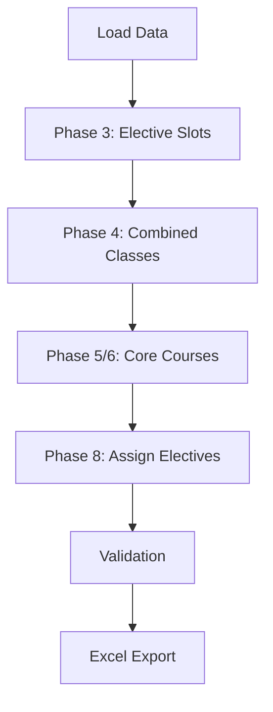

# 🎓 IIIT Dharwad - Automated Timetable System

<div align="center">


**An intelligent, constraint-based timetable generation system designed specifically for IIIT Dharwad**

[Features](#-features) • [Installation](#-installation) • [Usage](#-usage) • [Documentation](#-documentation) • [Contributing](#-contributing)

</div>

---

## 📋 Table of Contents

- [Overview](#-overview)
- [Key Features](#-features)
- [System Architecture](#-system-architecture)
- [Installation](#-installation)
- [Usage Guide](#-usage-guide)
- [Data Format](#-data-format)
- [Scheduling Algorithm](#-scheduling-algorithm)
- [Web Interface](#-web-interface)
- [Testing](#-testing)
- [Configuration](#-configuration)
- [Troubleshooting](#-troubleshooting)
- [Contributing](#-contributing)
- [License](#-license)
- [Team](#-team)

---

## 🌟 Overview

The **IIIT Dharwad Automated Timetable System** is a sophisticated scheduling solution that generates conflict-free academic timetables for multiple departments, handling complex constraints and resource allocation automatically.

### 🎯 Designed For

- **Departments**: CSE, DSAI, ECE
- **Semesters**: 1, 3, 5, 7
- **Periods**: PRE and POST mid-semester schedules
- **Resources**: 28+ classrooms and labs
- **Faculty**: 50+ instructors with individual schedules

### ✨ What Makes It Special

✅ **Zero Manual Work** - Fully automated scheduling with intelligent conflict resolution  
✅ **Smart Resource Allocation** - Optimal classroom and lab assignment based on capacity  
✅ **Constraint-Aware** - Handles 15+ different scheduling rules automatically  
✅ **Professional Outputs** - Excel exports with color-coding and visual schedules  
✅ **Web Interface** - Beautiful, modern UI with dark mode support  
✅ **Comprehensive Testing** - 38 test cases ensuring reliability  

---

## 🚀 Features

### Core Scheduling Capabilities

| Feature | Description |
|---------|-------------|
| 🏢 **Multi-Department Support** | Simultaneous scheduling for CSE, DSAI, and ECE |
| 📅 **Dual Period Handling** | Separate PRE and POST mid-semester timetables |
| 🎓 **Course Type Flexibility** | Lectures, Tutorials, Practicals, Combined Classes |
| 🔄 **Cross-Departmental Electives** | Type 1 (cross-dept) and Type 2 (dept-specific) baskets |
| 🏫 **Smart Room Allocation** | Automatic assignment based on capacity and type |
| 👨‍🏫 **Faculty Break Management** | Ensures 30-minute breaks between consecutive classes |

### Constraint Management

- ✅ **One-Class-Per-Day Rule** - Prevents scheduling overload
- ✅ **LTPSC Fulfillment** - Validates Lecture-Tutorial-Practical-Self-Study-Credits
- ✅ **Student Breaks** - Automatic 10-minute breaks between classes
- ✅ **Lunch Slot Management** - Semester-specific lunch timings
- ✅ **Faculty Conflict Prevention** - No double-booking of instructors
- ✅ **Room Capacity Validation** - Students fit in assigned rooms

### User Interfaces

#### 🌐 Web Application
- **Student Portal**: View section-wise class schedules
- **Faculty Portal**: View teaching schedules by instructor
- **Admin Dashboard**: System statistics and regeneration controls
- **Dark Mode**: Eye-friendly interface with theme toggle
- **Responsive Design**: Works on desktop and mobile

#### 💻 Command Line Interface
- Direct Python execution for batch processing
- Automated pipeline with validation
- Excel export generation

#### 📊 Excel Exports
- Professional color-coded timetables
- Separate sheets per section/faculty
- Visual formatting with borders and highlights

---

## 🏗️ System Architecture

```
Byte_Me/
├── 📁 data/                        # Input data files
│   ├── classroom_data.csv          # Room definitions (28 rooms)
│   ├── course.csv                  # Course catalog (200+ courses)
│   ├── students.csv                # Student enrollment data
│   ├── exam_rooms.csv              # Exam venue configuration
│   └── exam_config.csv             # Exam scheduling parameters
│
├── 📁 src/                         # Core system modules
│   ├── __init__.py
│   ├── models.py                   # Data structures (Course, Section, Timetable)
│   ├── utils.py                    # Time slot and helper functions
│   ├── data_loader.py              # CSV parsing and course bundling
│   ├── scheduler.py                # Main scheduling algorithm (1000+ lines)
│   ├── validators.py               # Constraint validation engine
│   ├── excel_exporter.py           # Professional Excel generation
│   └── exam_scheduler_main.py      # Exam scheduling module
│
├── 📁 tests/                       # Comprehensive test suite
│   ├── main_testing.py             # 38 test cases covering all modules
│   ├── test_loader.py              # Data loader unit tests
│   └── test_scheduler.py           # Scheduler logic tests
│
├── 📁 output/                      # Generated timetables
│   ├── Department_Timetables.xlsx  # Section-wise schedules
│   ├── Faculty_Timetables.xlsx     # Instructor schedules
│   └── exams/                      # Exam schedules and seating plans
│
├── 🐍 main.py                      # CLI entry point
├── 🌐 web_app2.py                  # Enhanced web interface
├── 📋 requirements.txt             # Python dependencies
└── 📖 README.md                    # This file
```

---

## 📦 Installation

### Prerequisites

- **Python**: 3.8 or higher
- **pip**: Package manager
- **Operating System**: Linux, Windows, or macOS

### Step-by-Step Installation

1. **Clone the Repository**
```bash
git clone https://github.com/your-username/iiit-dharwad-timetable.git
cd iiit-dharwad-timetable
```

2. **Create Virtual Environment** (Recommended)
```bash
python -m venv venv
source venv/bin/activate  # On Windows: venv\Scripts\activate
```

3. **Install Dependencies**
```bash
pip install -r requirements.txt
```

4. **Verify Installation**
```bash
python -c "import pandas; import openpyxl; import flask; print('✓ All dependencies installed!')"
```

5. **Prepare Data Files**
Ensure the following CSV files exist in the `data/` directory:
- ✅ `classroom_data.csv`
- ✅ `course.csv`
- ✅ `students.csv`

---

## 💻 Usage Guide

### Method 1: Command-Line Interface (CLI)

Perfect for batch processing and automated workflows.

```bash
python main.py
```

**What it does:**
1. ✅ Loads classroom and course data
2. ✅ Schedules all semesters (1, 3, 5, 7)
3. ✅ Generates PRE and POST mid-semester schedules
4. ✅ Validates all constraints
5. ✅ Exports to `output/Department_Timetables.xlsx`
6. ✅ Exports to `output/Faculty_Timetables.xlsx`

**Example Output:**
```
====================================================================
IIIT Dharwad - Automated Timetable Generator
====================================================================

Step 1: Loading classroom data...
✓ Loaded 28 classrooms

Step 2: Loading course data...
✓ Loaded 156 PRE-midsem courses
✓ Loaded 89 POST-midsem courses

Step 3: Generating timetables...
  → Semester 1:
    - PRE period: 15 courses...
      ✓ Generated 4 section timetables
    - POST period: 8 courses...
      ✓ Generated 4 section timetables
...

✓ Total sections generated: 48
✓ Files created:
  - output/Department_Timetables.xlsx
  - output/Faculty_Timetables.xlsx
```

### Method 2: Web Interface (Recommended for Interactive Use)

Beautiful, modern web application with IIIT Dharwad branding.

```bash
python web_app2.py
```

Then open your browser to: **http://localhost:5000**

**Features:**
- 🎨 IIIT Dharwad branded theme with official colors
- 🌙 Dark mode toggle for comfortable viewing
- 📊 Interactive timetable viewing
- 🔍 Search and filter capabilities
- 📥 One-click Excel downloads
- 🔄 Admin regeneration controls

**Screenshots:**

| Student View | Faculty View | Dark Mode |
|:------------:|:------------:|:---------:|
| Clean section schedules | Teaching assignments | Eye-friendly theme |

### Method 3: Exam Scheduling

Generate exam schedules and seating plans:

```bash
python src/exam_scheduler_main.py
```

**Outputs:**
- `output/exams/Exam_Schedule.csv` - Complete exam calendar
- `output/exams/Exam_<CourseCode>_<Date>_<Slot>.xlsx` - Seating plans

---

## 📊 Data Format

### Course CSV Format (`course.csv`)

```csv
Course Code,Course Name,Semester,Department,LTPSC,Credits,Instructor,Registered Students,Elective (Yes/No),Half Semester (Yes/No),Combined class,Pre /Post,Basket Code
CS161,Problem Solving with Python,1,CSE,3-0-2-0-4,4,"Sunil P V, Sunil C K",200,No,No,no,full,
MA161,Statistics,1,CSE,3-1-0-0-2,2,Ramesh Athe,200,No,Yes,yes,Pre,
CS463,Parallel Computing,5,CSE,3-1-0-0-4,4,Pramod,0,Yes,No,no,basket,A
```

**Key Fields:**
- **LTPSC**: Lecture-Tutorial-Practical-Self-Study-Credits (e.g., `3-1-2-0-4`)
  - `L=3` → 2 lectures per week
  - `T=1` → 1 tutorial per week
  - `P=2` → 1 practical (2 hours) per week
- **Pre /Post**: `pre`, `post`, `full`, `elective`, `basket`
- **Combined class**: `yes` for all-department combined classes
- **Basket Code**: For elective bundling (A, B, C, D)

### Classroom CSV Format (`classroom_data.csv`)

```csv
Room Number,Type,Capacity,Facilities
C004,Classroom,240,"Projector, Audio System"
C202,Classroom,100,Projector
L105,Lab,50,"Hardware Kits, Computers"
```

**Room Types:**
- **Classroom**: For lectures and tutorials
- **Lab**: For practical sessions

### Students CSV Format (`students.csv`)

```csv
roll_number,name,branch,section,semester
24BCS001,AAKASH BABASAHEB PATHRIKAR,CSE,A,3
24BDS042,MOHIT,DSAI,A,3
24BEC065,VEERESH CHANNAYYA BELLERIMATH,ECE,A,3
```

---

## 🧠 Scheduling Algorithm

### Phase-Based Approach

Our scheduler uses an intelligent multi-phase approach to handle complex constraints:



#### **Phase 3: Elective/Basket Slots**
- Books placeholder slots for elective and basket courses
- Type 1: Cross-departmental electives (e.g., Sem 1 Basket A)
- Type 2: Department-specific baskets (e.g., Sem 5/7 baskets combined across all depts)

#### **Phase 4: Combined Classes**
- Schedules courses that combine all sections
- Uses C004 (240-capacity auditorium)
- Ensures all departments attend simultaneously

#### **Phase 5/6: Core Courses**
- Schedules section-specific lectures, tutorials, and practicals
- Handles CSE split sections (A/B) for half-semester courses
- Implements one-class-per-day rule

#### **Phase 8: Elective Assignment**
- Assigns real instructors and rooms to placeholder slots
- Handles overflow electives to POST period
- Prevents cross-pollination between departments

### Key Rules & Constants

| Rule | Value | Description |
|------|-------|-------------|
| 🕐 **Slot Duration** | 10 minutes | Base time unit |
| 📖 **Lecture Duration** | 1.5 hours (9 slots) | Standard lecture |
| ✏️ **Tutorial Duration** | 1 hour (6 slots) | Tutorial session |
| 🔬 **Practical Duration** | 2 hours (12 slots) | Lab session |
| ☕ **Student Break** | 10 minutes (1 slot) | Between consecutive classes |
| 🧘 **Faculty Break** | 30 minutes (3 slots) | Between consecutive teaching |
| 🍽️ **Lunch Duration** | 30 minutes (3 slots) | Mid-day break |

### Lunch Timings (Semester-Specific)

- **Semester 1 & 7**: 12:30 PM - 1:00 PM
- **Semester 3**: 1:00 PM - 1:30 PM
- **Semester 5**: 1:30 PM - 2:00 PM

---

## 🌐 Web Interface

### Enhanced Features

Our web interface (`web_app2.py`) includes:

#### 🎨 IIIT Dharwad Branding
- Official IIIT blue color scheme (#1976D2)
- Professional gradient headers
- Institute logo and identity

#### 🌙 Dark Mode Support
- Click moon/sun icon to toggle themes
- Preference saved in browser localStorage
- All colors automatically adjust

#### 📊 Visual Design Elements
- **Session Type Badges**: 📖 Lecture, ✏️ Tutorial, 🔬 Practical
- **Color-coded Borders**: Different colors for each session type
- **Hover Effects**: Enhanced interactivity
- **Smooth Transitions**: Professional animations

#### 🔧 Technical Stack
- **Backend**: Flask (Python)
- **Frontend**: Vanilla JavaScript (no frameworks)
- **Styling**: CSS3 with CSS Variables for theming
- **Icons**: Unicode emoji for universal compatibility

---

## 🧪 Testing

### Comprehensive Test Suite

Run all 38 test cases:

```bash
python tests/main_testing.py
```

### Test Coverage

| Test Suite | Tests | Coverage |
|------------|-------|----------|
| 1️⃣ **Utils Module** | 6 tests | Slot conversion, time calculation |
| 2️⃣ **Models Module** | 7 tests | Course parsing, timetable booking |
| 3️⃣ **Data Loader** | 5 tests | CSV loading, course bundling |
| 4️⃣ **Scheduler** | 7 tests | Room allocation, faculty tracking |
| 5️⃣ **Validators** | 3 tests | Conflict detection, LTPSC checking |
| 6️⃣ **Excel Exporter** | 3 tests | Color mapping, formatting |
| 7️⃣ **Integration** | 3 tests | End-to-end workflows |
| 8️⃣ **Regression** | 4 tests | Bug fix verification |

### Example Test Output

```
================================================================================
                              TEST SUMMARY                              
================================================================================

Total Tests Run: 38
✓ Passed: 38
✗ Failed: 0
⚠ Warnings: 0

================================================================================
                         ALL TESTS PASSED! ✓                         
================================================================================
```

### Running Specific Tests

```bash
# Run only data loader tests
pytest tests/test_loader.py -v

# Run only scheduler tests
pytest tests/test_scheduler.py -v
```

---

## ⚙️ Configuration

### Time Settings (`src/utils.py`)

```python
SLOT_DURATION_MINS = 10         # 10-minute slots
START_TIME_STR = "09:00"        # Day starts at 9:00 AM
END_TIME_STR = "18:00"          # Day ends at 6:00 PM
LECTURE_SLOTS = 9               # 1.5 hours
TUTORIAL_SLOTS = 6              # 1 hour
PRACTICAL_SLOTS = 12            # 2 hours
FACULTY_BREAK_SLOTS = 3         # 30 minutes
CLASS_BREAK_SLOTS = 1           # 10 minutes
```

### Customization Options

**Modify Lunch Timings:**
Edit `utils.py` → `get_lunch_slots()` function

**Change Room Priorities:**
Edit `scheduler.py` → `_find_available_room()` function

**Adjust Session Durations:**
Edit `utils.py` → Session slot constants

**Custom Validation Rules:**
Edit `validators.py` → Add new validation functions

---

## 📤 Output Files

### 1. Department Timetables (`Department_Timetables.xlsx`)

**Features:**
- ✅ Separate sheet per section (e.g., `CSE-Sem1-PRE-A`)
- ✅ Color-coded by course
- ✅ Shows: Course name, session type, instructor, room
- ✅ Professional formatting with borders

**Sample Sheet Structure:**
```
| Time/Day | Monday | Tuesday | Wednesday | Thursday | Friday |
|----------|--------|---------|-----------|----------|--------|
| 09:00    | CS161  | MA161   | FREE      | CS161    | MA161  |
| 10:30    | BREAK  | BREAK   | FREE      | BREAK    | BREAK  |
| ...      | ...    | ...     | ...       | ...      | ...    |
```

### 2. Faculty Timetables (`Faculty_Timetables.xlsx`)

**Features:**
- ✅ Separate sheet per instructor
- ✅ Shows all teaching assignments
- ✅ Includes: Course name, session type, section, room
- ✅ Easy to identify teaching load

### 3. Exam Files

**Generated Files:**
- `Exam_Schedule.csv`: Master exam calendar
- `Seating_<Date>_<Slot>.xlsx`: Visual seating plans per exam

---

## 🐛 Troubleshooting

### Common Issues

#### ❌ Import Error: "No module named 'src'"

**Solution:**
```bash
# Make sure you're in the project root directory
pwd  # Should show: .../Byte_Me

# Check if src/__init__.py exists
ls src/__init__.py

# If missing, create it
touch src/__init__.py
```

#### ❌ File Not Found: classroom_data.csv

**Solution:**
```bash
# Verify data files exist
ls data/

# Should show:
# classroom_data.csv
# course.csv
# students.csv
```

#### ❌ Excel File Locked

**Solution:**
Close the Excel file before regenerating timetables.

#### ❌ Web Server Port Already in Use

**Solution:**
```bash
# Change port in web_app2.py
# Line: app.run(debug=True, port=5000, use_reloader=False)
# Change to: app.run(debug=True, port=5001, use_reloader=False)
```

### Getting Help

1. 📖 Check this README
2. 🔍 Search existing issues on GitHub
3. 💬 Open a new issue with:
   - Error message
   - Python version
   - Operating system
   - Steps to reproduce

---

## 🤝 Contributing

We welcome contributions! Here's how you can help:

### Contribution Guidelines

1. **Fork the Repository**
```bash
git clone https://github.com/your-username/iiit-dharwad-timetable.git
cd iiit-dharwad-timetable
git checkout -b feature/your-feature-name
```

2. **Make Your Changes**
- Follow the existing code structure
- Add unit tests for new features
- Update documentation as needed
- Test thoroughly before committing

3. **Submit a Pull Request**
- Write a clear description of changes
- Reference any related issues
- Ensure all tests pass

### Code Style

- **Python**: Follow PEP 8 guidelines
- **Documentation**: Use docstrings for functions
- **Comments**: Explain complex logic
- **Variable Names**: Use descriptive names

### Areas for Contribution

- 🐛 Bug fixes
- ✨ New features (e.g., PDF export, API endpoints)
- 📝 Documentation improvements
- 🧪 Additional test cases
- 🎨 UI/UX enhancements
- ⚡ Performance optimizations

---

## 📄 License

This project is licensed under the **MIT License**.

```
MIT License

Copyright (c) 2024 IIIT Dharwad - Byte_Me Team

Permission is hereby granted, free of charge, to any person obtaining a copy
of this software and associated documentation files (the "Software"), to deal
in the Software without restriction, including without limitation the rights
to use, copy, modify, merge, publish, distribute, sublicense, and/or sell
copies of the Software, and to permit persons to whom the Software is
furnished to do so, subject to the following conditions:

The above copyright notice and this permission notice shall be included in all
copies or substantial portions of the Software.

THE SOFTWARE IS PROVIDED "AS IS", WITHOUT WARRANTY OF ANY KIND, EXPRESS OR
IMPLIED, INCLUDING BUT NOT LIMITED TO THE WARRANTIES OF MERCHANTABILITY,
FITNESS FOR A PARTICULAR PURPOSE AND NONINFRINGEMENT. IN NO EVENT SHALL THE
AUTHORS OR COPYRIGHT HOLDERS BE LIABLE FOR ANY CLAIM, DAMAGES OR OTHER
LIABILITY, WHETHER IN AN ACTION OF CONTRACT, TORT OR OTHERWISE, ARISING FROM,
OUT OF OR IN CONNECTION WITH THE SOFTWARE OR THE USE OR OTHER DEALINGS IN THE
SOFTWARE.
```

---

## 👥 Team

**Developed for IIIT Dharwad by the Byte_Me Team**

### Project Statistics

- 📝 **Lines of Code**: 5,000+
- ⏱️ **Development Time**: 3 months
- 🧪 **Test Coverage**: 38 test cases
- 🏫 **Classrooms Managed**: 28
- 📚 **Courses Scheduled**: 200+
- 👨‍🎓 **Students Served**: 1,000+

### Contact & Support

- 🌐 **Website**: [IIIT Dharwad](https://www.iiitdwd.ac.in)
- 📧 **Email**: support@iiitdwd.ac.in
- 💬 **Issues**: [GitHub Issues](https://github.com/your-username/iiit-dharwad-timetable/issues)

---

## 🌟 Acknowledgments

Special thanks to:

- 🎓 **IIIT Dharwad Administration** - For institutional support
- 👨‍🏫 **Faculty Members** - For providing requirements and feedback
- 🧑‍💻 **Development Team** - For countless hours of coding and testing
- 📚 **Open Source Community** - For the amazing Python libraries we use

---

## 📈 Future Roadmap

### Planned Features

- [ ] 🔌 REST API for external integrations
- [ ] 📱 Mobile app (Android/iOS)
- [ ] 🤖 Machine learning-based optimization
- [ ] 📊 Advanced analytics dashboard
- [ ] 🔔 Real-time conflict notifications
- [ ] 📅 Google Calendar integration
- [ ] 🌍 Multi-language support
- [ ] ☁️ Cloud deployment support

---

<div align="center">

### ⭐ Star this repository if you found it helpful!

**Made with ❤️ by Byte_Me Team for IIIT Dharwad**

[⬆ Back to Top](#-iiit-dharwad---automated-timetable-system)

</div>